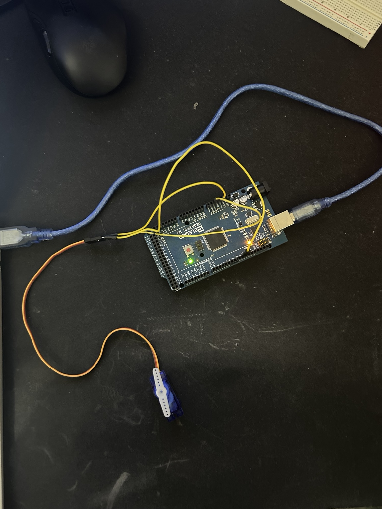

# AI Servo Hand Gesture Control

## Project Overview

This project is an AI-hardware pipeline that uses a vision model to recognize hand gestures and control a servo motor connected to an Arduino Mega 2560.

A webcam captures the user's hand gesture. A vision model that I trained classifies the image, and a Python program sends a command through the USB serial connection to the Arduino. The Arduino then moves an SG90 servo motor.

The project can be demonstrated as a simple AI-controlled lock:

- Open Hand = Unlock
- Closed Hand = Lock
- Nothing = No new action

## AI Model

I created and trained my own image classification model using Google Teachable Machine.

The model was trained with three classes:

1. Open Hand
2. Closed Hand
3. Nothing

The "Nothing" class allows the model to recognize when neither hand gesture is being shown instead of always predicting open or closed.

The model was exported using TensorFlow Lite and runs locally on the computer.

## Hardware



The hardware used for this project includes:

- Elegoo Mega 2560 / Arduino Mega 2560
- SG90 micro servo motor
- Jumper wires
- USB cable
- Computer with webcam

The SG90 servo is connected to the Arduino Mega and is controlled based on predictions made by the trained AI vision model.

The SG90 servo is connected to the Arduino Mega and is controlled based on the predictions made by the trained AI vision model.

## Servo Wiring

The SG90 servo uses three connections:

- Brown wire -> GND
- Red wire -> 5V
- Orange/Yellow wire -> Digital Pin 9

## How the Pipeline Works

Webcam -> AI Vision Model -> Python -> Serial Communication -> Arduino -> Servo Motor

1. The webcam captures a video frame.
2. Python prepares the image for the AI model.
3. The TensorFlow Lite model classifies the image.
4. If an Open Hand is detected with high confidence, Python sends `O` to the Arduino.
5. If a Closed Hand is detected with high confidence, Python sends `C` to the Arduino.
6. The Arduino receives the command through serial communication.
7. `O` moves the servo to 90 degrees.
8. `C` moves the servo to 0 degrees.

## Software

The project uses:

- Python
- OpenCV
- TensorFlow Lite
- NumPy
- PySerial
- Arduino IDE
- Google Teachable Machine

## Running the Project

The Arduino must first be connected to the computer and running the Arduino servo program.

The Python program can then be started from the project directory with:

```bash
python ai_servo.py
